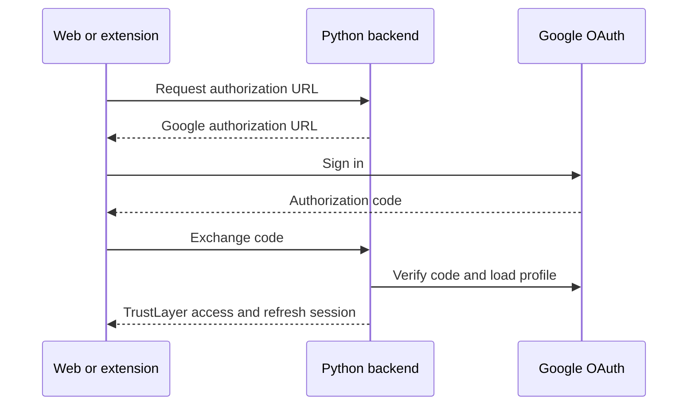

# TrustLayer

TrustLayer is a prototype trust infrastructure for social content. The browser
extension and web workspace use the same Google authentication backend.

## Repository

| Path | Purpose |
| --- | --- |
| `apps/back` | Dependency-free Python OAuth and session API |
| `apps/extension` | TypeScript WebExtension for Chrome, Edge, and Firefox |
| `apps/front` | React login and authenticated workspace |
| `Documents` | Product brief and preserved interface mockups |
| `packages/typescript-config` | Shared TypeScript defaults |

## Authentication flow



The web client stores the session in HTTP-only cookies. The extension stores
the returned TrustLayer tokens in extension-local storage and sends the access
token as a bearer token.

## Local setup

Requirements: Node.js 22+, npm 10+, and Python 3.11+.

```sh
cp .env.example .env
npm install
npm run dev
```

The backend listens on `http://localhost:3000` and Vite serves the public
TrustLayer landing page on `http://localhost:5173`. Web authentication is at
`/login`, and authenticated users are sent to `/workspace`.

Set `GOOGLE_CLIENT_ID` and `GOOGLE_CLIENT_SECRET` in `.env`. In Google Cloud,
register these redirect URIs:

- `http://localhost:5173/login/callback` for the web client
- the URL returned by `browser.identity.getRedirectURL("login/callback")` for
  each development extension build

The Chromium redirect normally has the form
`https://<extension-id>.chromiumapp.org/login/callback`.

## Commands

```sh
npm run dev                 # backend and web client
npm run dev:extension       # Chrome and Firefox development builds
npm run check               # typecheck, lint, and backend tests
npm run build               # backend, web, Chrome, Edge, and Firefox
```

Production extension bundles are written to `apps/extension/dist/<browser>`.

## Prototype limits

Backend sessions are stored in memory, so restarting the process signs users
out. Replace `SessionStore` with persistent storage before production use.
